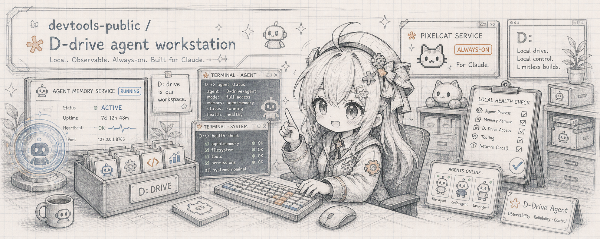

<p align="center">
  
</p>

<h1 align="center">DELVTOOLS_PUBLIC</h1>

<p align="center">
  <strong>Public-safe Windows agent workstation scripts for a D-drive-first, agentmemory-first setup.</strong>
</p>

<p align="center">
  
  
  
  
</p>

---

## What This Is

`DELVTOOLS_PUBLIC` / `devtools-public` is a clean export of reusable scripts and examples from a local `D:\devtools` agent workstation. The canonical local checkout is `D:\DELVTOOLS_PUBLIC`; the GitHub repository name and older local spelling remain `devtools-public`. Agents should read `AGENTS.md` and this README before changing public export files.

It documents a practical pattern:

- keep agent homes, runtimes, caches, and logs on `D:\devtools`
- use `agentmemory` as the active memory and coordination layer
- keep skills in `D:\AGENT_RESOURCE` / `D:\agent-resources`
- keep secrets in environment variables or ignored local files
- track only stable scripts, examples, and documentation

This is not a full copy of a machine. It intentionally excludes private agent homes, SQLite DBs, logs, sessions, browser profiles, credentials, model caches, local binaries, and research experiment artifacts.

## Layout

| Path | Purpose |
| --- | --- |
| `agentmemory-server.ps1` / `.cmd` | Starts local agentmemory from `D:\devtools\npm-global` with all tools and slots enabled on demand. |
| `AGENTS.md` | Agent operating contract for keeping this public export sanitized. |
| `health-check.ps1` | Read-only infrastructure check for agentmemory, launchers, D-drive junctions, and skill paths. |
| `codex-health.ps1` | Read-only performance and process-family report. |
| `codex-agent-report.ps1` | Read-only long-lived agent/process triage with command-line redaction. |
| `tools/Test-PrePushSafety.ps1` | Unified tracked/staged/history safety gate for public pushes. |
| `tools/Install-PrePushHook.ps1` | Installs the local Git `pre-push` hook that calls the safety gate. |
| `launchers/` | Public-safe launcher templates for Codex, Claude Code, ARIS, and supporting services. |
| `examples/` | Local secret templates and MCP/config examples. |

## Runtime Model

| Component | Default | Role |
| --- | --- | --- |
| `agentmemory` | `http://localhost:3111` | Persistent memory, recall, signals, actions, and checkpoints. |
| agentmemory viewer | `http://localhost:3113` | Optional local visual memory viewer. |
| PixelCat | `127.0.0.1:8990` | Local Claude-compatible proxy for CC-family tools while using Claude; optional during Codex-only maintenance. |
| key rotator | `127.0.0.1:9100` | Optional local OpenAI-compatible key/proxy helper. |

Agent Hub is retired and is not part of the active architecture.

## Quick Start

1. Install `agentmemory` using its upstream instructions.
2. Prefer a D-drive install for local agent packages:

```powershell
npm install -g @agentmemory/agentmemory --prefix D:\devtools\npm-global --cache D:\devtools\npm-cache
```

3. Ensure the pinned `iii.exe` engine used by agentmemory is on D-drive, for example `D:\devtools\npm-global\iii.exe`, and first in PATH when the server starts.
4. Put this repository at `D:\DELVTOOLS_PUBLIC` or copy the scripts you want into `D:\devtools`.
5. Copy `examples/devtools.local.example.cmd` to an ignored local file such as `D:\devtools\devtools.local.cmd`.
6. Set only the environment variables you actually use.
7. Start memory:

```powershell
powershell D:\devtools\agentmemory-server.ps1
```

8. Run a read-only check:

```powershell
powershell D:\devtools\health-check.ps1
```

Slots require `AGENTMEMORY_SLOTS=true` at service startup. If `memory_slot_list` returns HTTP 500 while the rest of agentmemory is healthy, restart the service with that environment flag; until then, coordinate through normal memory, signals, actions, checkpoints, git state, and explicit context packs.

`health-check.ps1` also checks `/agentmemory/mcp/tools`. PixelCat is a warning by default; pass `-RequirePixelCat` or set `DEVTOOLS_REQUIRE_PIXELCAT=1` / `DEVTOOLS_MODE=cc` for a Claude/CC readiness check. A healthy workstation should expose the full server-backed MCP tool surface; a tiny tool count means the MCP client has likely fallen back to standalone mode.

## Public-Safety Rules

Do not commit:

- `.env`, `*.local.cmd`, real MCP configs with keys, or shell history
- SQLite DBs, WAL/SHM files, logs, sessions, browser profiles, auth files
- local agent homes, plugin caches, model caches, generated images, toolchains, runtimes, or binaries
- research datasets, checkpoints, experiment outputs, or server logs

Before publishing, run a staged and tracked secret scan:

```powershell
git status --short
rg -n --hidden -S "sk-|api[_-]?key|token|secret|password|BEGIN .*PRIVATE KEY" .
```

Treat every hit as suspicious until reviewed. Placeholder examples are okay; real keys must be removed and rotated.

This repo also ships a stricter reusable gate:

```powershell
powershell .\tools\Test-PublicSafety.ps1
powershell .\tools\Test-HistorySafety.ps1
powershell .\tools\Test-PrePushSafety.ps1
powershell .\tools\Install-PrePushHook.ps1
powershell .\tools\Test-PublicSafety.ps1 -Path D:\agent-resources
powershell .\tools\Test-HistorySafety.ps1 -Path D:\agent-resources
```

The pre-push hook is intentionally installed locally rather than tracked as `.git/hooks/pre-push`. Re-run `tools\Install-PrePushHook.ps1` after cloning if this repository will publish changes.

`v0.1.0-public-clean` marks the first scanned public-clean baseline tag.

For rotation steps, see [`docs/credential-rotation-runbook.md`](docs/credential-rotation-runbook.md).

For agent collaboration examples, see [`examples/agentmemory-coordination.md`](examples/agentmemory-coordination.md).

For the upstream agentmemory and mem0 mapping, see [`docs/upstream-memory-systems-map.md`](docs/upstream-memory-systems-map.md).

For the private/public split, see [`docs/private-devtools-hygiene.md`](docs/private-devtools-hygiene.md).

## Related

| Project | Purpose |
| --- | --- |
| [agentmemory](https://github.com/rohitg00/agentmemory) | Upstream memory and MCP substrate. |
| [AGENT_RESOURCE / agent-resources](https://github.com/appleweiping/agent-resources) | Curated skills and implicit skill-routing map. |
| [WEIPING_WIKI / vipin-wiki](https://github.com/appleweiping/vipin-wiki) | Public knowledge base and agent operating contract. |
| [AGENTIC_SCIENCE](https://github.com/appleweiping/AGENTIC_SCIENCE) | Public workflow factory repo; UUPF can audit skill/workflow upgrades offline. |

## License

Apache-2.0.
