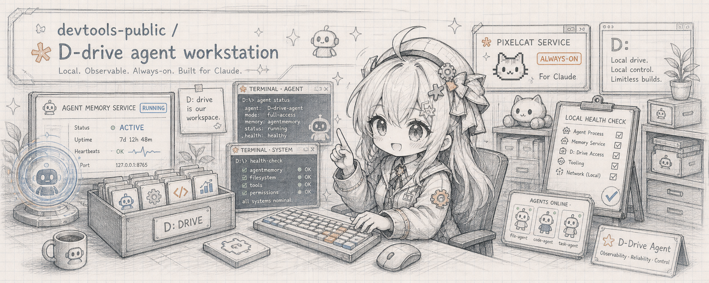

<p align="center">
  
</p>

<h1 align="center">devtools</h1>

<p align="center">
  <strong>A public-safe, reproducible Windows workstation layer for local coding agents, memory services, launchers, diagnostics, and Unity-MCP source provenance.</strong>
</p>

<p align="center">
  
  
  
  
</p>

## Purpose

`devtools` is the single canonical public repository for the reusable part of a
local `D:\devtools` workstation. It contains the stable scripts, portable
launcher templates, tests, documentation, examples, dependency locks, and
publication controls needed to reproduce the workstation layer.

"Complete and public" means the reproducible engineering surface is present and
reviewable. It does **not** mean copying private machine state into Git. Secrets,
OAuth sessions, databases, logs, caches, installed runtimes, proprietary
binaries, paid assets, and generated state remain local and ignored. This split
keeps the repository useful without pretending that redistributable source and
licensed/private state are the same thing.

## Repository map

| Path | Purpose |
| --- | --- |
| `agentmemory-*.ps1`, `agentmemory-server.cmd`, `agentmemory-host-guard.mjs`, `agentmemory-runtime-supervisor.mjs` | Portable server, concurrent runtime supervisor, authenticated Host guard, health, recovery, watchdog, and DPAPI-backed MCP launcher scripts. |
| `key-rotator.mjs` | Dependency-free, loopback-only key/target rotation proxy configured from the environment. |
| `health-check.ps1` | Read-only workstation readiness check. |
| `codex-health.ps1` | Read-only system and agent-family health report. |
| `codex-agent-report.ps1` | Redacted long-running agent/process diagnostics. |
| `launchers/` | Portable command templates for Codex, Claude Code, OpenCode, Gemini, ARIS, claudeseek, Hermes, PixelCat, uv, Bun, and helpers. |
| `examples/` | Placeholder-only local configuration and MCP examples. |
| `third_party/Unity-MCP` | Git submodule pinned to IvanMurzak/Unity-MCP `0.86.1`; source presence does not enable Editor automation. |
| `tests/` | Runtime, launcher, and adversarial security regression tests. |
| `tools/` | Public-surface/history gates plus opt-in portable shell reachability helpers. |
| `scripts/` | Portable local maintenance gates, including derived-lesson promotion. |
| `dependencies/agentmemory-runtime/` | Tracked manifest and lockfile for the integrity-addressed AgentMemory dependency closure; package payloads are not redistributed. |
| `public-surface.json` | Explicit allowlist for every publishable tree and exceptional artifact. |
| `docs/` | Runtime, publication, credential, local asset, and Unity compliance guidance. |

## Local/public boundary

The recommended layout is one real checkout at `D:\devtools`. Tracked files
coexist with ignored local installations and state:

```text
D:\devtools\
  launchers\                 # tracked templates
  tools\ tests\ docs\        # tracked engineering surface
  dependencies\             # tracked dependency manifests and locks only
  third_party\Unity-MCP\     # tracked gitlink / pinned upstream checkout
  devtools.local.cmd         # ignored launcher-only machine configuration
  data\ logs\ cache\         # ignored runtime state
  node\ npm-global\          # ignored installed runtimes
  codex\ claude\ ...         # ignored agent homes
  assets\licensed\           # ignored purchased/proprietary assets
```

Shared skill source belongs in `D:\AGENT_RESOURCE`; expose it to agents with
junctions or symlinks instead of copying and drifting the source tree. See
[`docs/private-devtools-hygiene.md`](docs/private-devtools-hygiene.md) and
[`docs/local-asset-vault.md`](docs/local-asset-vault.md).

## Bootstrap

Clone the repository without executing dependencies, then inspect it:

```powershell
git clone https://github.com/appleweiping/devtools.git D:\devtools
Set-Location D:\devtools
powershell.exe -NoProfile -ExecutionPolicy Bypass -File .\tools\Test-PrePushSafety.ps1
```

Copy the placeholder launcher configuration to an ignored local file and set
only the launcher/provider overrides needed on that machine:

```powershell
Copy-Item .\examples\devtools-config.example.cmd .\devtools.local.cmd
```

Only the command templates under `launchers\` load `devtools.local.cmd`.
Agentmemory services accept explicit PowerShell parameters or inherited process/user
environment variables. `AGENTMEMORY_SECRET` is mandatory, must match
`^[A-Za-z0-9_-]{32,256}$`, and direct service, health, promotion, and MCP
processes receive it through their process environment. Devtools never writes
the plaintext secret to a tracked file, generated settings file,
scheduled-task XML/action/arguments, command line, or log.

MCP clients can avoid inheriting a long-lived plaintext secret by invoking
`agentmemory-mcp-dpapi.ps1` with the canonical absolute path of the ignored
watchdog settings file. The launcher reuses the watchdog's closed settings and
DPAPI validation, temporarily supplies the decrypted secret and exact loopback
URL only to the pinned stdio child, redirects and incrementally flushes a raw-byte
stdio pump, restores its process environment in `finally`, and preserves the
child exit code. See
[`docs/mcp-dpapi-launcher.md`](docs/mcp-dpapi-launcher.md).

Scheduled-watchdog registration accepts `AGENTMEMORY_SECRET` only from the
registration process. Windows DPAPI `CurrentUser` protects it as a versioned
ciphertext blob under the ignored `<DataRoot>\run` directory. The ignored
settings JSON contains only the blob's absolute path and SHA-256 alongside
non-secret lifecycle fields. The task must run as the same current interactive
user identity that registered it. Its runner validates the closed settings
schema, canonical paths, blob location, version, and ciphertext hash before
decryption; it temporarily places the recovered secret in its process
environment solely for the self-heal child to inherit, then restores or clears
that environment value in `finally`.

The optional key rotator uses `ROTATOR_KEYS` and `ROTATOR_TARGETS` from the
environment or an ignored `key-rotator.local.cmd`. Each key must have one valid
target without embedded credentials; remote targets require HTTPS, while HTTP
is accepted only for explicit loopback hosts. The service itself listens only
on `127.0.0.1`. Responses, including SSE, are streamed with backpressure.
Only `GET`, `HEAD`, and `OPTIONS` may retry across slots. Every write method is
sent to one slot only, even when it carries `Idempotency-Key`, because different
targets or credentials need not share one idempotency domain. Every upstream
3xx is blocked as a local 502 without forwarding `Location`; see
[`docs/launcher-catalog.md`](docs/launcher-catalog.md) for the exact retry,
timeout, redirect, and forwarded-header policy.

Install the pinned Node.js runtime and packages under ignored directories. The
runtime scripts and MCP examples use the absolute trusted executable rather than
searching the current directory or `PATH`:

The supported runtime pair is Node `22.21.1` with npm `10.9.4`. The tracked lock
manifest pins `@agentmemory/agentmemory@0.9.27` and
`@agentmemory/mcp@0.9.27`, including the complete transitive closure.

```powershell
$nodeUrl = 'https://nodejs.org/dist/v22.21.1/node-v22.21.1-win-x64.zip'
$nodeZip = Join-Path $env:TEMP 'node-v22.21.1-win-x64.zip'
$nodeStage = Join-Path $env:TEMP ('node-v22.21.1-' + [Guid]::NewGuid().ToString('N'))
Invoke-WebRequest -UseBasicParsing -Uri $nodeUrl -OutFile $nodeZip
if ((Get-Item -LiteralPath $nodeZip).Length -ne 35556042) { throw 'Unexpected Node archive size' }
if ((Get-FileHash -Algorithm SHA256 -LiteralPath $nodeZip).Hash.ToLowerInvariant() -ne '3c624e9fbe07e3217552ec52a0f84e2bdc2e6ffa7348f3fdfb9fbf8f42e23fcf') { throw 'Node archive hash mismatch' }
Expand-Archive -LiteralPath $nodeZip -DestinationPath $nodeStage
$stagedNodeRoot = Join-Path $nodeStage 'node-v22.21.1-win-x64'
$stagedNodeExe = Join-Path $stagedNodeRoot 'node.exe'
if ((Get-Item -LiteralPath $stagedNodeExe).Length -ne 85800448) { throw 'Unexpected Node executable size' }
if ((Get-FileHash -Algorithm SHA256 -LiteralPath $stagedNodeExe).Hash.ToLowerInvariant() -ne '471961cb355311c9a9dd8ba417eca8269ead32a2231653084112554cda52e8b3') { throw 'Node executable hash mismatch' }
if (Test-Path -LiteralPath D:\devtools\node) { throw 'D:\devtools\node already exists; audit it before replacement' }
Move-Item -LiteralPath $stagedNodeRoot -Destination D:\devtools\node
& D:\devtools\node\node.exe --version # expected: v22.21.1
& D:\devtools\node\npm.cmd --version # expected: 10.9.4

# Install only into the dedicated ignored AgentMemory prefix. Never run npm ci
# in the shared D:\devtools\npm-global directory.
$agentMemoryInstall = 'D:\devtools\npm-global\agentmemory-runtime'
if (Test-Path -LiteralPath $agentMemoryInstall) { throw 'Audit the existing AgentMemory prefix before replacement' }
New-Item -ItemType Directory -Path $agentMemoryInstall | Out-Null
Copy-Item -LiteralPath `
  .\dependencies\agentmemory-runtime\package.json, `
  .\dependencies\agentmemory-runtime\package-lock.json `
  -Destination $agentMemoryInstall
& D:\devtools\node\npm.cmd ci --ignore-scripts `
  --prefix $agentMemoryInstall `
  --cache D:\devtools\npm-cache

# iii.exe is a separate pinned release asset; npm does not install it on Windows.
$iiiUrl = 'https://github.com/iii-hq/iii/releases/download/iii/v0.11.2/iii-x86_64-pc-windows-msvc.zip'
$iiiZip = Join-Path $env:TEMP 'iii-x86_64-pc-windows-msvc-0.11.2.zip'
$iiiStage = Join-Path $env:TEMP ('iii-0.11.2-' + [Guid]::NewGuid().ToString('N'))
Invoke-WebRequest -UseBasicParsing -Uri $iiiUrl -OutFile $iiiZip
if ((Get-Item -LiteralPath $iiiZip).Length -ne 10336536) { throw 'Unexpected iii archive size' }
if ((Get-FileHash -Algorithm SHA256 -LiteralPath $iiiZip).Hash.ToLowerInvariant() -ne '6b1a624be64367aadcbcf5654543fc3029ebb73f3092f4de0d85c3e2e7fac402') { throw 'iii archive hash mismatch' }
Expand-Archive -LiteralPath $iiiZip -DestinationPath $iiiStage
$stagedIii = Join-Path $iiiStage 'iii.exe'
if ((Get-FileHash -Algorithm SHA256 -LiteralPath $stagedIii).Hash.ToLowerInvariant() -ne '2447bc21906a6b5be270868da7e74a1c744a4644cf3bd4b37a228ba4e55478ca') { throw 'iii executable hash mismatch' }
Copy-Item -LiteralPath $stagedIii -Destination $agentMemoryInstall\iii.exe
& $agentMemoryInstall\iii.exe --version # expected: 0.11.2
if ($env:AGENTMEMORY_SECRET -notmatch '^[A-Za-z0-9_-]{32,256}$') {
  throw 'Supply AGENTMEMORY_SECRET from the invoking environment before startup'
}
powershell.exe -NoProfile -ExecutionPolicy Bypass -File .\agentmemory-server.ps1
powershell.exe -NoProfile -ExecutionPolicy Bypass -File .\agentmemory-health-daily.ps1
```

The Node archive comes from the official Node.js distribution. The iii archive
is the x86-64 Windows asset from the official
[`iii/v0.11.2` release](https://github.com/iii-hq/iii/releases/tag/iii%2Fv0.11.2).
Use the matching upstream architecture asset and digest on non-x86-64 hosts.
The temporary archive and staging directory may be removed after the executable
hash and version checks pass.

`npm ci --ignore-scripts` deliberately suppresses dependency lifecycle scripts.
The dependency-lock regression test keeps every lifecycle-bearing package
explicit; if an optional feature needs a generated/native payload, audit and
provision that payload separately instead of enabling scripts across the whole
closure. The lockfile redistributes metadata only, not package payloads, and
does not replace review of each transitive package's license.

For a public REST port `R` (default `3111`, maximum `5997`), the authenticated
Host guard is the only listener at `R`. The upstream compatibility viewer is a
fixed internal listener at `127.0.0.2:6002`; it is not at `R + 2`. Internal iii
REST, stream, and worker-manager listeners are fixed to `127.0.0.1` ports
`6000`, `6667`, and `10080`. There must be no listener at public `R + 2` or the
retired `R + 1` and `R + 46023` addresses. The fixed iii ports are in the
[WHATWG Fetch bad-port list](https://fetch.spec.whatwg.org/#port-blocking), and
the [WebSockets opening handshake uses Fetch](https://websockets.spec.whatwg.org/#opening-handshake),
which prevents browser APIs from bypassing the guard. This is defense in depth:
loopback binding and bearer authentication remain mandatory.

The guard accepts only exact `localhost:R` or `127.0.0.1:R` Host and Origin
values, safe or absent `Sec-Fetch-Site`, and one valid Bearer credential. It
authenticates before reading a request body or contacting upstream. AgentMemory
MCP `0.9.27` forwards its inherited `AGENTMEMORY_SECRET`; keep the secret out of
the tracked MCP examples.

The server starts the tracked runtime supervisor directly with the pinned Node
executable. The supervisor starts pinned iii first with an allowlisted,
credential-free environment, waits for its three internal listeners, and then
starts the pinned AgentMemory entry point and Host guard as two more direct
children without a shell. The Node children inherit the server-controlled
environment; iii never receives `AGENTMEMORY_SECRET`. Any child exit, spawn
failure, readiness failure, or supervisor termination signal stops the complete
three-child group and returns a failure. The canonical iii template contains no
external-process `exec` or `watch` directive and is verified against its reviewed
SHA-256 before any token is materialized.

The compatibility viewer authenticates its API proxy before attempting an
upstream request. In pinned `0.9.27`, that proxy uses Node Fetch, which must
reject internal port `6000` as a WHATWG bad port. The managed isolation probe
therefore requires missing and wrong Bearer credentials to return `401` and the
exact credential to reach the blocked proxy path and return `502`; a `200`
viewer proxy response is rejected. The Host guard at `R` is the only working
authenticated REST surface. The runtime also permits only the reserved
`agentmemory-viewer.invalid:6002` Host authority. That `.invalid` authority is
intentionally unusable as a normal browser destination: no interactive viewer
is supported, and users must never enter `AGENTMEMORY_SECRET` into the upstream
viewer UI. Its configured Origin is CORS response metadata, not request
authentication.

Managed server startup/adoption, readiness, self-heal, and health paths prove
the exact loopback listeners and expected process ownership before sending a
Bearer credential to either local HTTP surface. The upstream MCP module and the
derived-lesson ingestion HTTP client cannot independently prove OS-level
listener ownership before sending their inherited Bearer credential. Run those
clients only against the managed, already-verified local service and keep
`AGENTMEMORY_URL` pinned to its exact loopback endpoint.

If the supervisor is hard-killed during startup or steady state, self-heal may
remove the remaining iii-led child subset only after proving exact executable,
anchored command line, common missing parent, process creation time, and
listener ownership. It never adopts the orphan and refuses to restart unless
every original identity and all managed/retired ports are gone.

Self-heal starts each short-lived server controller with separate port-specific
stdout/stderr logs and waits only for that exact process object. It does not use
a native pipeline or process-tree `-Wait`, so the intentionally long-lived
supervisor cannot retain a controller pipe and stall recovery completion.

The broader `health-check.ps1` additionally expects a separately provisioned
shared `AGENT_RESOURCE` tree and agent launchers; use it only after those external
workstation prerequisites are installed.

Configuration parameters and safe defaults are documented in
[`docs/runtime-services.md`](docs/runtime-services.md); launcher lookup and
override behavior are in [`docs/launcher-catalog.md`](docs/launcher-catalog.md).
Durable memory fields and the derivation-layer promotion boundary are defined in
[`docs/agent-memory-protocol.md`](docs/agent-memory-protocol.md).

Inspect portable launcher reachability without changing the machine by running
the verifier without `-Apply`; drift produces a nonzero exit code:

```powershell
powershell.exe -NoProfile -ExecutionPolicy Bypass -File .\tools\agent-launcher-verify.ps1
powershell.exe -NoProfile -ExecutionPolicy Bypass -File .\tools\agent-launcher-verify.ps1 -Apply -WhatIf
```

Only explicit `-Apply` may update the selected PowerShell profile, current-user
`cmd.exe` AutoRun, or user `PATH`. The optional scheduled verifier requires the
additional `-RegisterTask` switch and is considered healthy only when its action,
arguments, daily cadence, identity, enabled state, and active lifetime match.
Registry read errors fail closed. Generated profiles remain Windows PowerShell
5.1-safe for non-ASCII paths, while CMD wrappers use the active Windows OEM code
page without a BOM. Persistent `-Apply` rejects `%` or `!` in configured paths,
and rejects paths that cannot be represented by that OEM code page. See
[`docs/launcher-catalog.md`](docs/launcher-catalog.md) before applying changes.

## Unity-MCP source and authorization gate

The upstream source lock is intentionally reproducible:

```powershell
git submodule update --init --depth 1 -- third_party/Unity-MCP
git -C .\third_party\Unity-MCP rev-parse HEAD
# expected: e59211c610a1481ef2a8a1e6e7fe8010e7e5a509
```

Downloading or inspecting source does not authorize automated Unity access.
Do not add the MCP to an agent configuration, authenticate it, start its server,
or let it query/control Unity Editor until Unity provides verifiable written
authorization for the exact version and transport. The evidence standard,
public upstream inquiry, and Unity support request template are in
[`docs/unity-mcp-compliance.md`](docs/unity-mcp-compliance.md). Third-party
license provenance is recorded in [`THIRD_PARTY_NOTICES.md`](THIRD_PARTY_NOTICES.md).

## Verification

Run the behavior and publication checks before every commit or push:

```powershell
& D:\devtools\node\node.exe --test .\tests\agentmemory-host-guard.test.mjs
& D:\devtools\node\node.exe --test .\tests\agentmemory-runtime-supervisor.test.mjs
& D:\devtools\node\node.exe --test .\tests\security\agentmemory-dependency-lock.test.mjs
& D:\devtools\node\node.exe --test .\tests\key-rotator.test.mjs
powershell.exe -NoProfile -ExecutionPolicy Bypass -Command '$r=Invoke-Pester .\tests\core\RuntimeScripts.Tests.ps1 -PassThru; if($r.FailedCount -gt 0){exit 1}'
powershell.exe -NoProfile -ExecutionPolicy Bypass -Command '$r=Invoke-Pester .\tests\core\WatchdogPersistence.Tests.ps1 -PassThru; if($r.FailedCount -gt 0){exit 1}'
powershell.exe -NoProfile -ExecutionPolicy Bypass -Command '$r=Invoke-Pester .\tests\core\McpDpapiLauncher.Tests.ps1 -PassThru; if($r.FailedCount -gt 0){exit 1}'
pwsh.exe -NoProfile -Command '$r=Invoke-Pester .\tests\core\McpDpapiLauncher.Tests.ps1 -PassThru; if($r.FailedCount -gt 0){exit 1}'
powershell.exe -NoProfile -ExecutionPolicy Bypass -File .\tests\launchers\Test-LauncherTemplates.ps1
powershell.exe -NoProfile -ExecutionPolicy Bypass -Command '$r=Invoke-Pester .\tests\shell\ShellReachability.Tests.ps1 -PassThru; if($r.FailedCount -gt 0){exit 1}'
powershell.exe -NoProfile -ExecutionPolicy Bypass -Command '$r=Invoke-Pester .\tests\memory\IngestLessonsWrapper.Tests.ps1 -PassThru; if($r.FailedCount -gt 0){exit 1}'
& D:\devtools\node\node.exe --test .\tests\memory\ingest-lessons.test.mjs
powershell.exe -NoProfile -ExecutionPolicy Bypass -File .\tests\security\Test-PublicSafetyGates.ps1
powershell.exe -NoProfile -ExecutionPolicy Bypass -File .\tools\Test-PublicSafety.ps1
powershell.exe -NoProfile -ExecutionPolicy Bypass -File .\tools\Test-HistorySafety.ps1
powershell.exe -NoProfile -ExecutionPolicy Bypass -File .\tools\Test-PrePushSafety.ps1
git diff --check
```

The CI workflow repeats the security suite from a full-history checkout without
initializing or executing submodules. Install the local pre-push hook with
`tools\Install-PrePushHook.ps1`. The gate denies archives without exception,
scans binary and Git metadata, and requires a publication tip's final manifest
to retain explicit tombstones/provenance for retired reachable objects. Details
and threat model are in
[`docs/publication-security.md`](docs/publication-security.md).

## Related projects

| Project | Purpose |
| --- | --- |
| [agentmemory](https://github.com/rohitg00/agentmemory) | Memory and MCP substrate used by the runtime scripts. |
| [Unity-MCP](https://github.com/IvanMurzak/Unity-MCP) | Pinned third-party Unity integration source; separately licensed and authorization-gated. |
| [agent-resources](https://github.com/appleweiping/agent-resources) | Shared skill source and routing index. |
| [WEIPING_WIKI](https://github.com/appleweiping/WEIPING_WIKI) | Durable public route map and maintenance documentation. |

## License

Repository-authored material is Apache-2.0. Submodules and other third-party
material retain their own licenses; see `THIRD_PARTY_NOTICES.md`.
